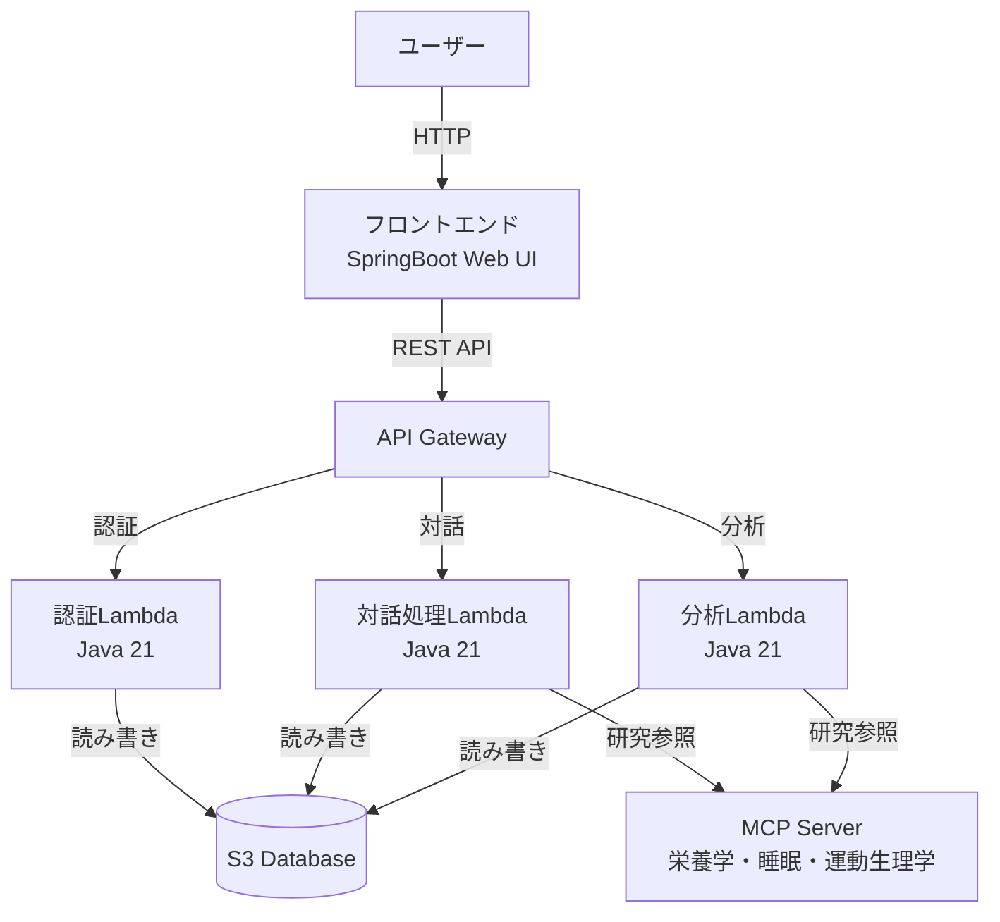

# Design Document

## Overview

健康管理チャットアドバイザーは、ユーザーが気軽に健康情報を入力し、AIとの対話を通じて健康管理を行うシステムです。本システムは、SpringBoot（Java 21）をバックエンドとし、AWS Lambda + API Gatewayで対話処理を実行し、S3をデータストレージとして使用します。MCP（Model Context Protocol）を活用して最新の栄養学・睡眠研究・運動生理学の情報を参照し、科学的根拠に基づいたパーソナライズされたアドバイスを提供します。

### Key Design Principles

1. **拡張性優先**: 初期開発段階に適したアーキテクチャで、機能追加が容易
2. **費用効率**: サーバーレスアーキテクチャによる運用コスト最小化
3. **シンプルな対話**: 140文字以内の短いメッセージで気軽に入力
4. **科学的根拠**: MCP経由で最新研究を参照し、信頼性の高いアドバイスを提供

## Architecture

### System Architecture



### Component Layers

1. **プレゼンテーション層**
   - SpringBoot Web UI（フロントエンド）
   - Chart.js または JFreeChart によるグラフ表示

2. **API層**
   - API Gateway（リクエストルーティング、認証・認可）

3. **ビジネスロジック層**
   - 認証Lambda: ユーザー認証、セッション管理
   - 対話処理Lambda: メッセージ解析、健康データ抽出、アドバイス生成
   - 分析Lambda: 栄養素推定、心理状態分析、短歌生成

4. **データアクセス層**
   - S3 Client: データの読み書き、構造化ストレージ管理

5. **外部統合層**
   - MCP Client: 最新研究情報の参照

## Components and Interfaces

### 1. Authentication Service

**責務**: ユーザー認証とセッション管理

**インターフェース**:
```java
public interface AuthenticationService {
    AuthResult authenticate(String username, String password);
    boolean validateToken(String token);
    void invalidateToken(String token);
}

public class AuthResult {
    private boolean success;
    private String token;
    private String userId;
    private String errorMessage;
}
```

**実装詳細**:
- AWS Lambda（Java 21）で実装
- セッショントークンはJWT形式
- ユーザー情報はS3に保存（`users/{userId}/profile.json`）
- トークンの有効期限は24時間

### 2. Chat Interface Service

**責務**: ユーザーとの対話処理、メッセージ解析

**インターフェース**:
```java
public interface ChatService {
    ChatResponse processMessage(String userId, String message, String token);
}

public class ChatResponse {
    private String responseText;
    private HealthData extractedData;
    private String advice;
    private TankaPoem tanka;
}

public class HealthData {
    private Double weight;
    private Double bodyFatPercentage;
    private List<String> foodItems;
    private List<String> exercises;
    private String freeComment;
}
```

**実装詳細**:
- AWS Lambda（Java 21）で実装
- 自然言語処理により体重・体脂肪・食事・運動を抽出
- 最大140文字の入力を受け付け
- MCP経由で最新研究を参照してアドバイス生成

### 3. Nutrition Estimator

**責務**: 食事内容から栄養素を推定

**インターフェース**:
```java
public interface NutritionEstimator {
    NutritionInfo estimateNutrition(List<String> foodItems);
    DailyNutrition calculateDailyTotal(String userId, LocalDate date);
}

public class NutritionInfo {
    private double calories;
    private double protein;
    private double fat;
    private double carbohydrate;
}

public class DailyNutrition {
    private double totalCalories;
    private PFCBalance pfcBalance;
}

public class PFCBalance {
    private double proteinRatio;
    private double fatRatio;
    private double carbohydrateRatio;
}
```

**実装詳細**:
- 分析Lambda内のコンポーネントとして実装
- 食品データベース（JSON形式、S3に保存）を参照
- MCP経由で最新の栄養学情報を取得

### 4. Mental State Analyzer

**責務**: 対話内容から心理状態を分析

**インターフェース**:
```java
public interface MentalStateAnalyzer {
    MentalState analyze(String message, List<String> conversationHistory);
}

public class MentalState {
    private EmotionalTone tone; // POSITIVE, NEUTRAL, DISCOURAGED
    private double motivationLevel; // 0.0 - 1.0
    private List<String> indicators;
}

public enum EmotionalTone {
    POSITIVE,
    NEUTRAL,
    DISCOURAGED
}
```

**実装詳細**:
- 分析Lambda内のコンポーネントとして実装
- 感情分析アルゴリズムを使用（キーワードベース + 文脈分析）
- 過去の対話履歴を考慮してトレンドを把握

### 5. Tanka Generator

**責務**: 日々の健康記録を短歌として生成

**インターフェース**:
```java
public interface TankaGenerator {
    TankaPoem generate(HealthData data, MentalState mentalState);
}

public class TankaPoem {
    private String line1; // 5音
    private String line2; // 7音
    private String line3; // 5音
    private String line4; // 7音
    private String line5; // 7音
    private LocalDate date;
}
```

**実装詳細**:
- 分析Lambda内のコンポーネントとして実装
- 健康データと心理状態を元に短歌を生成
- 5-7-5-7-7の音数制約を遵守

### 6. Health Advisor AI

**責務**: 科学的根拠に基づいた健康アドバイスの生成

**インターフェース**:
```java
public interface HealthAdvisorAI {
    AdviceResult generateAdvice(HealthData data, MentalState mentalState, UserProfile profile);
}

public class AdviceResult {
    private String mainAdvice;
    private List<String> actionableRecommendations;
    private List<ResearchReference> references;
}

public class ResearchReference {
    private String topic; // nutrition, sleep, exercise
    private String summary;
    private String source;
}
```

**実装詳細**:
- 対話処理Lambda内のコンポーネントとして実装
- MCP経由で最新の栄養学・睡眠研究・運動生理学を参照
- ユーザーの心理状態に応じてトーンを調整

### 7. Data Repository

**責務**: S3へのデータ永続化と取得

**インターフェース**:
```java
public interface DataRepository {
    void saveHealthData(String userId, HealthData data);
    List<HealthData> getHealthDataByDateRange(String userId, LocalDate start, LocalDate end);
    void saveNutritionInfo(String userId, LocalDate date, NutritionInfo info);
    void saveMentalState(String userId, LocalDate date, MentalState state);
    void saveTanka(String userId, TankaPoem tanka);
    List<TankaPoem> getTankaHistory(String userId);
}
```

**実装詳細**:
- S3のディレクトリ構造:
  ```
  health-chat-data/
    users/
      {userId}/
        profile.json
        health/
          {year}/
            {month}/
              {day}.json
        nutrition/
          {year}/
            {month}/
              {day}.json
        mental/
          {year}/
            {month}/
              {day}.json
        tanka/
          {year}/
            {month}/
              {day}.json
  ```
- JSON形式でデータを保存
- 日付ベースのパーティショニングで効率的な検索

### 8. Graph Generator

**責務**: 体重・体脂肪率のグラフ生成

**インターフェース**:
```java
public interface GraphGenerator {
    byte[] generateGraph(List<HealthData> data, TimeRange range);
}

public enum TimeRange {
    ONE_MONTH,
    THREE_MONTHS,
    SIX_MONTHS
}
```

**実装詳細**:
- SpringBootバックエンドまたはフロントエンド（Chart.js）で実装
- JFreeChartを使用する場合はバックエンドで画像生成
- Chart.jsを使用する場合はフロントエンドでレンダリング

## Data Models

### User Profile
```json
{
  "userId": "string",
  "username": "string",
  "passwordHash": "string",
  "createdAt": "ISO8601 timestamp",
  "lastLoginAt": "ISO8601 timestamp"
}
```

### Health Data Entry
```json
{
  "userId": "string",
  "date": "ISO8601 date",
  "timestamp": "ISO8601 timestamp",
  "weight": "number (kg)",
  "bodyFatPercentage": "number (%)",
  "foodItems": ["string"],
  "exercises": ["string"],
  "freeComment": "string"
}
```

### Nutrition Info
```json
{
  "userId": "string",
  "date": "ISO8601 date",
  "totalCalories": "number (kcal)",
  "protein": "number (g)",
  "fat": "number (g)",
  "carbohydrate": "number (g)",
  "pfcBalance": {
    "proteinRatio": "number (0-1)",
    "fatRatio": "number (0-1)",
    "carbohydrateRatio": "number (0-1)"
  }
}
```

### Mental State Record
```json
{
  "userId": "string",
  "date": "ISO8601 date",
  "timestamp": "ISO8601 timestamp",
  "tone": "POSITIVE | NEUTRAL | DISCOURAGED",
  "motivationLevel": "number (0-1)",
  "indicators": ["string"]
}
```

### Tanka Poem
```json
{
  "userId": "string",
  "date": "ISO8601 date",
  "lines": {
    "line1": "string (5音)",
    "line2": "string (7音)",
    "line3": "string (5音)",
    "line4": "string (7音)",
    "line5": "string (7音)"
  },
  "summary": "string"
}
```


## Correctness Properties

*A property is a characteristic or behavior that should hold true across all valid executions of a system-essentially, a formal statement about what the system should do. Properties serve as the bridge between human-readable specifications and machine-verifiable correctness guarantees.*

### Property 1: Credential verification correctness
*For any* username and password combination, the system should accept valid credentials and reject invalid credentials
**Validates: Requirements 1.2**

### Property 2: Token creation on authentication
*For any* successful authentication, the system should create and return a valid session token
**Validates: Requirements 1.3**

### Property 3: Token validation on requests
*For any* API request with a session token, the system should accept requests with valid tokens and reject requests with invalid tokens
**Validates: Requirements 1.4**

### Property 4: Token invalidation on logout
*For any* logout operation, the session token should become invalid and subsequent requests using that token should be rejected
**Validates: Requirements 1.5**

### Property 5: Message length acceptance
*For any* message up to 140 characters, the system should accept it; for any message over 140 characters, the system should reject it
**Validates: Requirements 2.1**

### Property 6: Weight extraction
*For any* message containing weight information in various formats (e.g., "体重65kg", "65キロ", "weight: 65"), the system should correctly extract the numeric weight value
**Validates: Requirements 2.2**

### Property 7: Body fat extraction
*For any* message containing body fat percentage information in various formats, the system should correctly extract the numeric percentage value
**Validates: Requirements 2.3**

### Property 8: Food extraction
*For any* message containing food descriptions, the system should extract the food items as a list
**Validates: Requirements 2.4**

### Property 9: Exercise extraction
*For any* message containing exercise descriptions, the system should extract the exercise activities as a list
**Validates: Requirements 2.5**

### Property 10: Graph generation
*For any* user with historical health data, requesting visualization should produce a graph containing the data points
**Validates: Requirements 3.1**

### Property 11: Time range filtering
*For any* selected time range (30, 90, or 180 days), the system should return data for exactly that number of days from the current date
**Validates: Requirements 3.2, 3.3, 3.4**

### Property 12: Nutrition estimation
*For any* food text input, the nutrition estimator should produce estimates for calories, protein, fat, and carbohydrate
**Validates: Requirements 4.1**

### Property 13: Daily calorie aggregation
*For any* set of food entries in a day, the total daily calories should equal the sum of individual entry calories
**Validates: Requirements 4.2, 4.4**

### Property 14: PFC balance calculation
*For any* set of nutritional data, the PFC balance ratios should sum to 1.0 (or 100%) and correctly represent the proportion of each macronutrient
**Validates: Requirements 4.3**

### Property 15: Data persistence round-trip
*For any* health data, nutrition data, mental state, or tanka saved to S3, retrieving it should return data equivalent to what was saved
**Validates: Requirements 4.5, 6.4, 7.3, 8.1**

### Property 16: MCP research reference
*For any* health data input, the Health Advisor AI should make MCP calls to reference nutrition, sleep, and exercise research
**Validates: Requirements 5.1, 5.2, 5.3**

### Property 17: Advice generation
*For any* completed health analysis with user data and research references, the system should generate advice containing actionable recommendations
**Validates: Requirements 5.4, 5.5**

### Property 18: Tanka generation
*For any* completed daily health input session, the system should generate a tanka poem
**Validates: Requirements 6.1**

### Property 19: Tanka syllable structure
*For any* generated tanka, each line should follow the 5-7-5-7-7 syllable structure (line1: 5, line2: 7, line3: 5, line4: 7, line5: 7)
**Validates: Requirements 6.2**

### Property 20: Tanka content relevance
*For any* generated tanka, the content should incorporate key health events from the day (weight, food, exercise, or emotional state)
**Validates: Requirements 6.3**

### Property 21: Tanka retrieval
*For any* user with tanka history, requesting past diary entries should return all tankas for the requested date range
**Validates: Requirements 6.5**

### Property 22: Mental state analysis
*For any* conversation input, the Mental State Analyzer should produce an analysis identifying emotional indicators (positivity, motivation, or discouragement)
**Validates: Requirements 7.1, 7.2**

### Property 23: Advice tone adaptation for positive state
*For any* user showing positive and motivated mental state patterns, the generated advice should have an encouraging and challenging tone
**Validates: Requirements 7.4**

### Property 24: Advice tone adaptation for discouraged state
*For any* user showing discouraged or negative mental state patterns, the generated advice should have a supportive and gentle tone
**Validates: Requirements 7.5**

### Property 25: Data consistency
*For any* data operation involving related records (e.g., health data and nutrition data for the same day), the system should maintain consistency across all related records
**Validates: Requirements 8.3**

### Property 26: Historical data retrieval
*For any* user with historical data, requesting data for a specific date range should return all records within that range
**Validates: Requirements 8.4**

### Property 27: Error handling
*For any* database operation failure, the system should log the error and handle it gracefully without crashing
**Validates: Requirements 8.5**

### Property 28: Free-form comment acceptance
*For any* free-form text input (regardless of format or content), the system should accept and store it
**Validates: Requirements 11.1**

### Property 29: Consultation categorization
*For any* message containing concern or worry keywords, the system should categorize it as consultation content
**Validates: Requirements 11.2**

### Property 30: Empathetic response
*For any* consultation content, the system response should contain empathetic language
**Validates: Requirements 11.3**

### Property 31: Context incorporation in advice
*For any* challenge discussion, the generated advice should reference the specific challenge mentioned by the user
**Validates: Requirements 11.4**

### Property 32: Consultation continuity
*For any* user with consultation history, new advice should reference relevant past discussions to provide continuity
**Validates: Requirements 11.5**

## Error Handling

### Authentication Errors
- **Invalid Credentials**: Return 401 Unauthorized with clear error message
- **Expired Token**: Return 401 Unauthorized and prompt re-authentication
- **Missing Token**: Return 401 Unauthorized

### Input Validation Errors
- **Message Too Long**: Return 400 Bad Request with character limit information
- **Invalid Data Format**: Accept the message but log parsing failures for monitoring
- **Empty Message**: Return 400 Bad Request

### Data Access Errors
- **S3 Read Failure**: Log error, return 500 Internal Server Error, retry up to 3 times
- **S3 Write Failure**: Log error, return 500 Internal Server Error, retry up to 3 times
- **Data Not Found**: Return 404 Not Found with helpful message

### External Service Errors
- **MCP Unavailable**: Log warning, generate advice without research references, notify user
- **MCP Timeout**: Log warning, use cached research data if available

### Lambda Execution Errors
- **Timeout**: Log error, return 504 Gateway Timeout
- **Out of Memory**: Log error, return 500 Internal Server Error
- **Unhandled Exception**: Log full stack trace, return 500 Internal Server Error

## Testing Strategy

### Unit Testing

本システムでは、以下のコンポーネントに対してJUnitを使用した単体テストを実施します：

1. **Authentication Service**
   - 有効な認証情報でのログイン成功
   - 無効な認証情報でのログイン失敗
   - トークンの有効期限切れ処理

2. **Message Parser**
   - 体重・体脂肪の抽出（様々な形式）
   - 食事・運動情報の抽出
   - エッジケース（空文字、特殊文字、境界値）

3. **Nutrition Estimator**
   - 既知の食品の栄養素推定
   - 複数食品の集計
   - PFCバランス計算

4. **Mental State Analyzer**
   - ポジティブな表現の検出
   - ネガティブな表現の検出
   - ニュートラルな表現の処理

5. **Tanka Generator**
   - 5-7-5-7-7の音数制約
   - 健康データの組み込み

6. **Data Repository**
   - S3への保存・取得
   - エラーハンドリング

### Property-Based Testing

本システムでは、**jqwik**（Java用のProperty-Based Testingライブラリ）を使用して、Correctness Propertiesを検証します。

**Property-Based Testing設定**:
- 各プロパティテストは最低100回の反復実行を行う
- ランダムな入力データを生成してプロパティを検証
- 失敗時には最小の反例（shrinking）を提供

**テストタグ形式**:
各プロパティベーステストには、以下の形式でコメントを付与します：
```java
/**
 * Feature: health-chat-advisor, Property 1: Credential verification correctness
 */
```

**主要なプロパティテスト**:

1. **Property 1-4: 認証関連**
   - ランダムな認証情報を生成して検証
   - トークンのライフサイクルをテスト

2. **Property 6-9: データ抽出**
   - 様々な形式のメッセージを生成
   - 抽出結果の正確性を検証

3. **Property 13-14: 栄養計算**
   - ランダムな食品リストを生成
   - 集計とPFCバランスの正確性を検証

4. **Property 15: Round-trip**
   - ランダムなデータを生成
   - 保存→取得で同じデータが返ることを検証

5. **Property 19: 短歌の音数**
   - 生成された短歌の各行の音数を検証

6. **Property 23-24: アドバイストーン**
   - 様々な心理状態に対するアドバイスのトーンを検証

### Integration Testing

以下の統合テストを実施します：

1. **End-to-End Flow**
   - ログイン → メッセージ送信 → データ保存 → グラフ表示
   - 短歌生成と取得

2. **AWS Integration**
   - Lambda関数の実行
   - API Gatewayのルーティング
   - S3へのデータ永続化

3. **MCP Integration**
   - MCP経由での研究情報取得
   - タイムアウト・エラー処理

### Test Data Generation

**jqwikのArbitraryを使用したテストデータ生成**:

```java
// 体重データ（30-150kg）
Arbitrary<Double> weights = Arbitraries.doubles()
    .between(30.0, 150.0);

// 体脂肪率（5-50%）
Arbitrary<Double> bodyFat = Arbitraries.doubles()
    .between(5.0, 50.0);

// メッセージ（1-140文字）
Arbitrary<String> messages = Arbitraries.strings()
    .withCharRange('a', 'z')
    .ofMinLength(1)
    .ofMaxLength(140);

// 日付範囲
Arbitrary<LocalDate> dates = Arbitraries.dates()
    .between(LocalDate.now().minusYears(1), LocalDate.now());
```

### Performance Testing

初期開発段階では詳細なパフォーマンステストは実施しませんが、以下の基本的な指標を監視します：

- Lambda実行時間（CloudWatch Logs）
- API Gatewayのレスポンスタイム
- S3の読み書き時間

## Deployment Strategy

### Infrastructure as Code

AWS CDK（Java）を使用してインフラをコード化します：

```java
// Lambda関数の定義
Function chatLambda = Function.Builder.create(this, "ChatLambda")
    .runtime(Runtime.JAVA_21)
    .handler("com.health.chat.ChatHandler")
    .timeout(Duration.seconds(30))
    .memorySize(512)
    .build();

// API Gatewayの定義
RestApi api = RestApi.Builder.create(this, "HealthChatApi")
    .restApiName("Health Chat API")
    .build();

// S3バケットの定義
Bucket dataBucket = Bucket.Builder.create(this, "HealthDataBucket")
    .versioned(false)
    .lifecycleRules(List.of(
        LifecycleRule.builder()
            .transitions(List.of(
                Transition.builder()
                    .storageClass(StorageClass.INFREQUENT_ACCESS)
                    .transitionAfter(Duration.days(90))
                    .build()
            ))
            .build()
    ))
    .build();
```

### Deployment Pipeline

1. **ビルド**: Maven/Gradleでビルド
2. **テスト**: 単体テスト + プロパティベーステスト実行
3. **パッケージング**: Lambda用のJARファイル作成
4. **デプロイ**: AWS CDKでインフラとコードをデプロイ

### Cost Optimization

運用費用を最小化するための戦略：

1. **Lambda**: 実行時間の最適化、適切なメモリサイズ設定
2. **S3**: ライフサイクルポリシーで古いデータをInfrequent Accessに移行
3. **API Gateway**: キャッシング戦略の実装
4. **CloudWatch**: ログ保持期間の最適化（30日）

### Monitoring and Logging

- **CloudWatch Logs**: Lambda実行ログ、エラーログ
- **CloudWatch Metrics**: Lambda実行回数、エラー率、実行時間
- **X-Ray**: 分散トレーシング（オプション）
